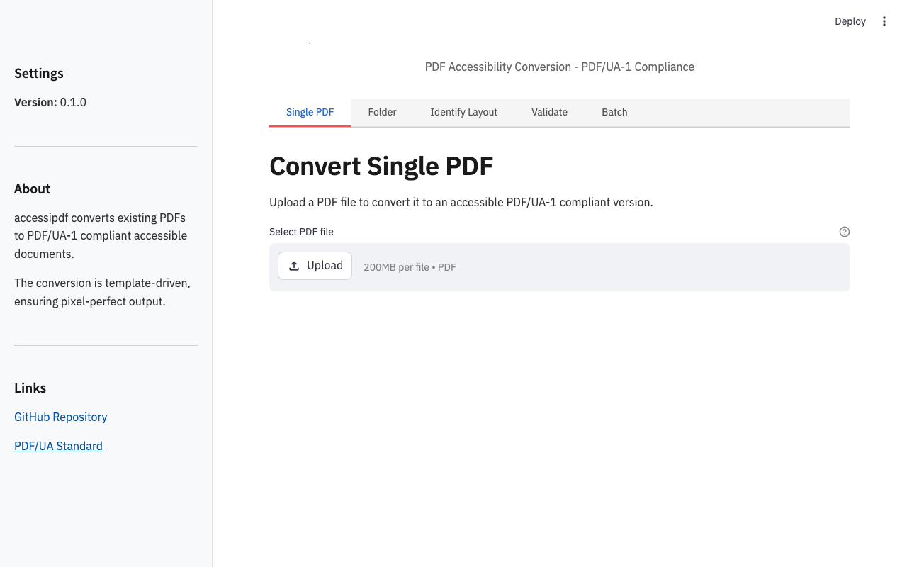
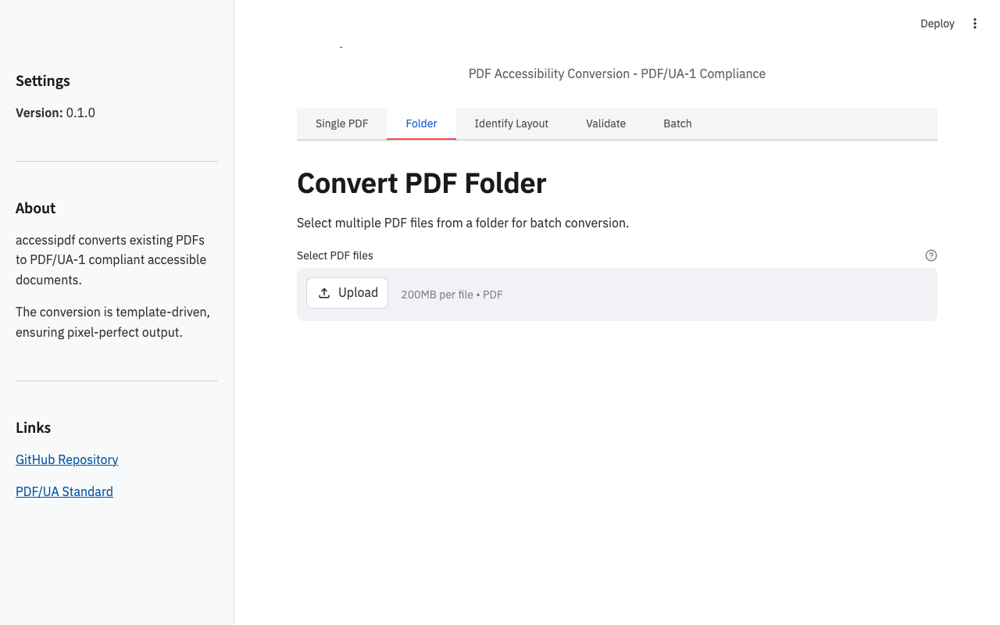
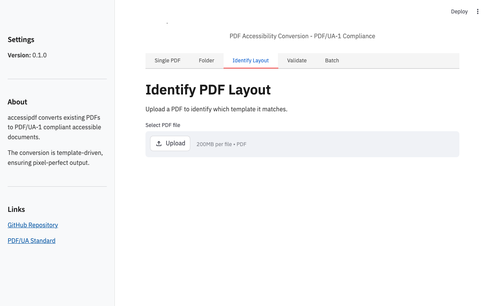
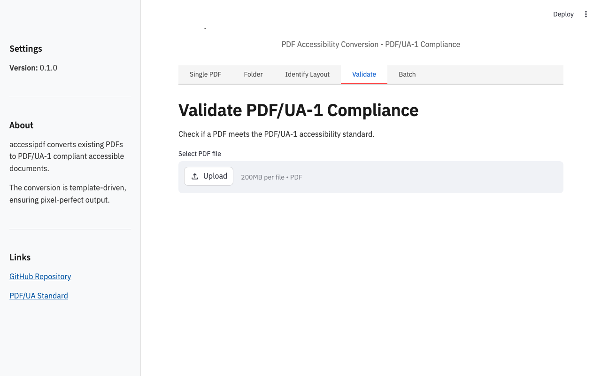
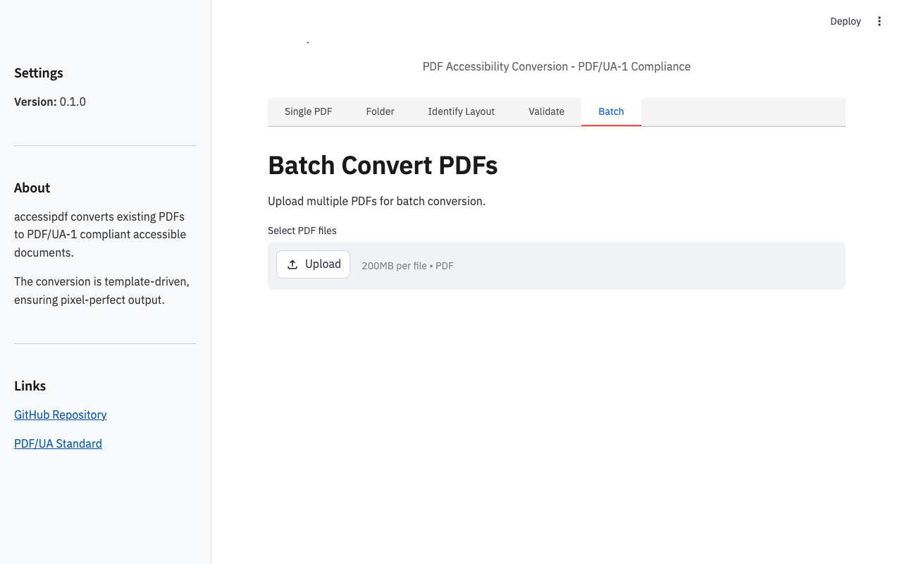

# accessipdf


**Make existing PDFs accessible — template-driven PDF/UA-1 tagging engine, pixel-identical output, veraPDF-gated.**

---

## Demo


**▶ [Demo video, 37 s](docs/media/demo.mp4)** — the conversion and the verification.

---

## What it does

accessipdf converts existing PDFs to **PDF/UA-1 compliant** accessible documents without changing their visual appearance. The conversion is **template-driven** — you define the layout once, and all PDFs matching that layout are processed consistently.

### The 5-Stage Pipeline

1. **Parse** – Extract content streams, graphics state, and text operators with positions (using pikepdf and pypdfium2)
2. **Match** – Identify the PDF against registered YAML layout templates using anchor texts
3. **Map** – Apply semantic roles (H1, P, Table, Artifact) based on zone definitions from the template
4. **Rewrite** – Inject marked content (BDC/EMC with MCIDs), build structure tree, set language/title/XMP metadata, repair fonts (generate ToUnicode CMaps, embed Liberation fonts, fix CIDToGIDMap, drop broken CIDSets)
5. **Validate** – Hand results to veraPDF; green files move to output, red files go to quarantine with full reports

### Key Features

- **Idempotent** – SHA-256 registry prevents duplicate processing
- **Performance** – ~0.1-0.15s per invoice (JVM start for veraPDF adds ~0.7s)
- **Pixel-perfect** – Output renders identically to the original
- **Three validation gates** – veraPDF compliance, pixel-diff rendering, text extraction integrity
- **Template system** – YAML-based layout definitions, readable and versionable

---

## Screenshots

The Streamlit GUI provides a web interface for all accessipdf functions:

| Main Interface | Single PDF Conversion |
|----------------|------------------------|
|  |  |

| Folder Conversion | Identify Layout |
|------------------|-----------------|
|  |  |

| Validate PDF/UA-1 | Batch Processing |
|-------------------|------------------|
|  |  |

---

## Quickstart

### Prerequisites

- **Python** 3.12 or newer
- **veraPDF CLI** – Required for PDF/UA-1 validation
  - macOS: `brew install verapdf`
  - Linux (Debian/Ubuntu): `sudo apt-get install verapdf`
  - Windows: Download from [veraPDF releases](https://github.com/veraPDF/veraPDF-apps/releases)

### Installation

```bash
# Clone the repository
git clone https://github.com/mkupermann/accessipdf.git
cd accessipdf

# Create virtual environment and install dependencies
make setup

# Generate a demo PDF
.venv/bin/python -m accessipdf.demo demo_invoice.pdf

# Try the CLI
.venv/bin/accessipdf identify demo_invoice.pdf     # Layout: acme-demo
.venv/bin/accessipdf check demo_invoice.pdf        # FAIL — untagged, broken fonts
.venv/bin/accessipdf convert demo_invoice.pdf out/ # tag, repair, validate
.venv/bin/accessipdf check out/demo_invoice.pdf    # PASS — PDF/UA-1
```

### Exit Codes

- `0` – All files processed successfully
- `1` – At least one file went to quarantine
- `2` – Hard error during processing

---

## Usage Options

### 1. Command Line Interface (CLI)

**Commands:**

```bash
# Convert PDF(s)
accessipdf convert <input> <output_dir> [--quarantaene <quarantine_dir>]

# Identify layout
accessipdf identify <pdf_file>

# Check PDF/UA-1 compliance
accessipdf check <pdf_file>

# Show version
accessipdf --version
```

**Examples:**

```bash
# Single file
accessipdf convert input/invoice.pdf output/

# Directory of files
accessipdf convert input/ output/

# Identify which template a PDF matches
accessipdf identify my_document.pdf

# Verify PDF/UA-1 compliance
accessipdf check accessible_document.pdf
```

---

### 2. Streamlit Web GUI

A beautiful, professional web interface for all accessipdf functions.

**Start the GUI:**

```bash
# Option 1: Using make
make gui

# Option 2: Direct command
.venv/bin/python scripts/run_gui.py

# Option 3: Streamlit directly
.venv/bin/streamlit run gui/app.py
```

The GUI will be available at: **http://localhost:8501**

**GUI Features:**

| Tab | Function | Description |
|-----|----------|-------------|
| **Single PDF** | Convert one PDF | Upload a single PDF, auto-detect layout, convert, download result |
| **Folder** | Batch convert | Select multiple PDFs from same folder, convert all at once |
| **Identify Layout** | Template detection | Upload a PDF to see which template it matches |
| **Validate** | PDF/UA-1 check | Validate any PDF against the accessibility standard |
| **Batch** | Multi-file convert | Upload multiple PDFs, process all, download as ZIP |

**GUI Design:**

- Professional, clean interface using IBM Plex Sans
- No emojis, clear typography
- Color-coded status messages:
  - Green (#2e7d32) – Success
  - Red (#c62828) – Error
  - Blue (#1565c0) – Information
  - Orange (#e65100) – Warning
- Responsive layout
- Real-time feedback

---

### 3. Docker Container

Run accessipdf in a containerized environment with all dependencies pre-installed.

**Quick Start:**

```bash
# Build the image
docker-compose build

# Start the GUI
docker-compose up -d accessipdf-gui

# Access the GUI at: http://localhost:8501
```

**Docker Commands:**

```bash
# Build image
docker-compose build

# Start GUI service
docker-compose up -d accessipdf-gui

# View logs
docker-compose logs -f accessipdf-gui

# Stop service
docker-compose down

# CLI-only (for batch processing)
docker-compose run --rm accessipdf-cli convert /app/input/ /app/output/
```

**Dockerfile Features:**

- Multi-stage build for smaller final image
- Python 3.12-slim base
- veraPDF pre-installed
- All Python dependencies in virtual environment
- Health checks configured
- Persistent volumes for uploads/outputs/quarantine

**Volumes:**

| Host Path | Container Path | Purpose |
|-----------|-----------------|---------|
| `./uploads/` | `/app/uploads/` | Uploaded files |
| `./outputs/` | `/app/outputs/` | Processed files |
| `./quarantine/` | `/app/quarantine/` | Failed conversions |

---

## Adding Your Own Layout Template

accessipdf uses YAML templates to define PDF layouts. Each template specifies:
- **Anchors** – Unique text at specific coordinates that identify the layout
- **Zones** – Bounding boxes mapped to semantic roles (H1, P, Table, Artifact, etc.)
- **Fields** – Extract metadata from specific areas (e.g., invoice number)
- **Language** – Document language for accessibility

### Step-by-Step Guide

1. **Analyze your PDF** to find text coordinates:
   ```bash
   .venv/bin/python scripts/zonen_dump.py your_file.pdf 1
   ```
   This prints all text operators with their coordinates.

2. **Create a template file** in `accessipdf/templates/vorlagen/` (e.g., `my-layout.yaml`):

```yaml
name: my-layout
sprache: en-US
titel_muster: "Invoice {invoice_no}"

# Anchor texts that uniquely identify this layout
erkennung:
  - { text: "My Company Ltd.", seite: 1, bbox: [50, 770, 300, 800] }
  - { text: "Invoice no:", seite: 1, bbox: [340, 692, 560, 712] }

# Fields to extract for dynamic title
felder:
  invoice_no:
    seite: 1
    bbox: [340, 692, 560, 712]

# Zones - mapped to semantic roles in reading order
zonen:
  - { name: letterhead, seiten: "1", bbox: [50, 770, 560, 800], rolle: P }
  - { name: subject, seiten: "1", bbox: [50, 590, 400, 620], rolle: H1 }
  - name: items
    seiten: alle
    bbox: [50, 420, 560, 575]
    rolle: Table
    kopf_anker: ["Item", "Unit price"]
    spalten: [290, 370, 460]
  - { name: smallprint, seiten: alle, bbox: [50, 40, 560, 62], rolle: Artifact }

# Default role for unmatched content
unbekannt_als: P
```

3. **Test your template:**
   ```bash
   .venv/bin/accessipdf identify your_file.pdf
   .venv/bin/accessipdf convert your_file.pdf test_output/
   ```

### Zone Types

| Role | Description | PDF Tag |
|------|-------------|---------|
| `H1`, `H2`, `H3`, etc. | Headings | `<H1>`, `<H2>`, etc. |
| `P` | Paragraph | `<P>` |
| `Table` | Table with header cells | `<Table>`, `<TR>`, `<TH>`, `<TD>` |
| `Artifact` | Decorative/non-content | `<Figure>` |
| `List` | List items | `<L>`, `<LI>` |
| `Link` | Hyperlink | `<Link>` |

### Page Selectors

| Value | Meaning |
|-------|---------|
| `"1"` | Page 1 only |
| `"alle"` | All pages |
| `"letzte"` | Last page only |
| `"ab2"` | Page 2 and beyond |

---

## Validation Gates

Every converted PDF passes through **three validation gates** before being accepted:

### 1. veraPDF Compliance
- Validates against **PDF/UA-1** standard
- Zero errors required
- Full rule report in quarantine for failures

### 2. Pixel-Perfect Rendering
- Renders each page before and after conversion
- Compares pixel-by-pixel
- Allows anti-aliasing noise at glyph edges
- Noise must survive erosion mask (9x9 kernel)

### 3. Text Extraction Integrity
- Extracts text before and after
- No line of previously extractable text may be lost
- Text may improve (ToUnicode generation fixes garbled text)

---

## CI/CD Pipeline

The project includes a comprehensive CI/CD setup:

### GitHub Actions Workflow (`.github/workflows/test.yml`)

**Matrix:**
- **OS**: Ubuntu, macOS, Windows
- **Python**: 3.12, 3.13, 3.14

**Jobs:**

1. **test** – Run full test suite with coverage
   - Installs veraPDF on each platform
   - Runs pytest with coverage
   - Uploads to Codecov

2. **type-check** – Static type checking with mypy

3. **lint** – Code style checking with ruff

**Running Tests Locally:**

```bash
# All tests
make test

# With coverage
make test-cov

# Type checking
make type-check

# Linting
make lint

# Fix linting issues
make lint-fix
```

---

## Project Structure

```
accessipdf/
├── accessipdf/
│   ├── __init__.py              # Version and package info
│   ├── cli.py                   # Command-line interface
│   ├── demo.py                  # Demo invoice generator
│   ├── pipeline.py              # Main conversion pipeline
│   ├── semantics.py             # Semantic role assignment
│   ├── testkit.py               # Test utilities
│   ├── core/
│   │   └── model.py             # Core data models
│   ├── tagging/
│   │   ├── fonts.py             # Font repair
│   │   ├── metadata.py          # PDF metadata
│   │   ├── structure.py         # Structure tree
│   │   ├── tables.py            # Table handling
│   │   ├── tokenizer.py         # Text tokenization
│   │   ├── walker.py            # Content walking
│   │   └── wrap.py              # Content wrapping
│   ├── templates/
│   │   ├── loader.py            # Template loading
│   │   └── vorlagen/            # YAML templates
│   │       └── acme-demo.yaml    # Demo template
│   └── validate/
│       └── verapdf.py           # veraPDF wrapper
├── gui/
│   ├── __init__.py              # GUI package
│   ├── app.py                   # Streamlit application
│   └── README.md                # GUI documentation
├── scripts/
│   ├── run_gui.py               # GUI launch script
│   ├── zonen_dump.py            # Zone coordinate dumper
│   └── capture_screenshots.py   # Screenshot generator
├── tests/
│   ├── test_*.py                # Unit tests
│   └── playwright/
│       └── __init__.py           # Playwright tests
├── docs/
│   ├── media/
│   │   ├── demo.gif             # Demo animation
│   │   ├── demo.mp4             # Demo video
│   │   └── gui/                 # GUI screenshots
│   └── ...
├── .github/
│   └── workflows/
│       └── test.yml             # CI configuration
├── Dockerfile                   # Docker build
├── docker-compose.yml           # Docker Compose
├── .dockerignore                # Docker ignore
├── pyproject.toml               # Project config
├── Makefile                     # Common tasks
├── README.md                    # This file
└── LICENSE                      # MIT License
```

---

## Browser-Based Testing

The project includes **Playwright tests** for the Streamlit GUI:

**Install Playwright:**
```bash
make playwright-install
```

**Run GUI Tests:**
```bash
make test-gui
```

**Test Coverage:**
- GUI loads successfully
- All 5 tabs are accessible
- Tab content renders correctly
- Sidebar has expected content
- File uploader is present
- Download buttons work correctly

---

## Performance

| Task | Duration |
|------|----------|
| Engine processing (per PDF) | 0.1-0.15s |
| veraPDF validation (per PDF) | ~0.7s (JVM startup) |
| Full pipeline (per PDF) | ~0.85-1s |

**Optimizations:**
- SHA-256 registry for idempotent operations
- Template caching
- Parallel processing in batch mode
- Multi-stage Docker build for smaller images

---

## Production Use

### Recommended Setup

1. **Create templates** for all your PDF layouts
2. **Test with sample PDFs** from each layout
3. **Set up monitoring** for quarantine directory
4. **Automate batch processing** with Docker or cron

### Example Workflow

```bash
# 1. Set up input/output directories
mkdir -p input output quarantine

# 2. Process all PDFs in input/
accessipdf convert input/ output/ --quarantaene quarantine/

# 3. Check results
ls output/      # Successful conversions
ls quarantine/  # Failed conversions with reports

# 4. Review quarantine reports
cat quarantine/*.bericht.json
```

### Docker Production Setup

```bash
# Create persistent volumes
mkdir -p ./uploads ./outputs ./quarantine

# Start with Docker Compose
docker-compose up -d accessipdf-gui

# Access at http://localhost:8501
```

---

## Contributing

See [CONTRIBUTING.md](CONTRIBUTING.md) for:
- Development setup
- Running tests
- Adding new templates
- Code quality standards

---

## License

MIT License – see [LICENSE](LICENSE).

The bundled Liberation fonts are licensed under the SIL Open Font License – see [accessipdf/assets/LIZENZ-LiberationSans.txt](accessipdf/assets/LIZENZ-LiberationSans.txt).

veraPDF is called as an external tool and is not part of this distribution.
