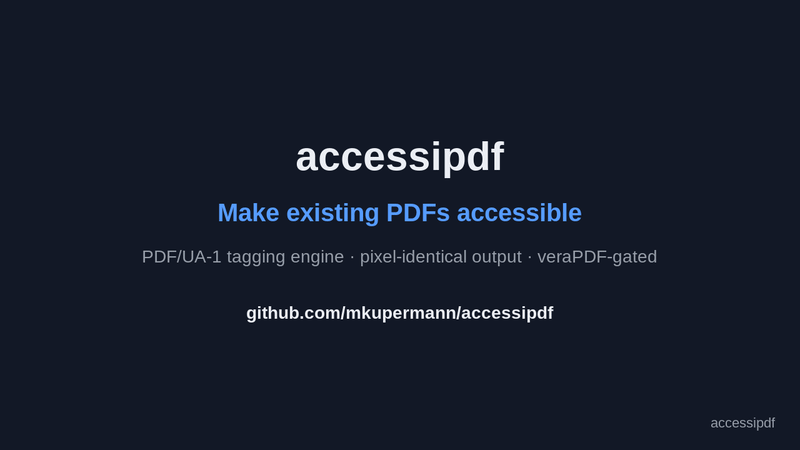

# accessipdf


Screen readers get nothing useful out of most PDFs in circulation. There are no
headings to jump between, the character codes often map to nothing a reader can
pronounce, and the fonts the file relies on aren't in the file. The document
looks fine and reads as noise.

What is missing can be put back without rebuilding the document. accessipdf
takes PDFs from a known layout, an invoice run, a statement run, anything a
template produced, and writes out a tagged, PDF/UA-1 conformant version whose
pages render pixel for pixel like the original. No commercial SDK involved. The
rules come from a layout template rather than a model guessing at structure, and
[veraPDF](https://verapdf.org/) validates every single file before it is allowed
out.

## Why

The European Accessibility Act and its German transposition, the BFSG, have
applied since 28 June 2025. Section 508 has been in force in the US for far
longer. What the deadlines changed is not the standard but the exposure: a
document you serve to a customer today has to work for that customer today.

Regenerating the archive is usually not on the table. The system that produced
those invoices has moved on, or was replaced, or the layout was signed off by
people who have left. And even where regeneration is possible, it is the wrong
tool, because the requirement is to add an invisible layer, not to reissue a
document that customers already have on file.

So the retrofit has a hard constraint. The original stays untouched, and the
output has to be visually identical to the pixel. Anything that shifts a line or
drops a glyph is a different document, and a different document is a new problem.



**▶ [Demo video, 37 s](https://github.com/mkupermann/accessipdf/blob/main/docs/media/demo.mp4)** — the conversion and the verification.

## What it does

Five stages per file.

1. Parse the content streams, track the graphics state, and recover every text
   operator with its position and decoded text (pikepdf and pypdfium2).
2. Match the file against the registered YAML layout templates using anchor
   texts. A layout nobody registered goes to quarantine with a
   machine-readable report rather than to a heuristic.
3. Map zones to roles from the template. Headings, paragraphs, real tables with
   header cells (`TR`/`TH`/`TD`, including tables that run over several pages),
   decorative content marked as artifacts, and the reading order.
4. Rewrite the content streams with marked content (`BDC`/`EMC` plus MCIDs),
   build the structure tree, set language, title and the XMP PDF/UA identifier.
   Then repair the fonts: generate the `ToUnicode` CMaps that are missing, embed
   metric-compatible Liberation faces for the standard fonts that were never
   embedded (bold stays bold), fix `CIDToGIDMap`, drop broken `CIDSet`s.
5. Hand the result to veraPDF. Green moves to the output directory atomically.
   Red moves to quarantine together with the full rule report. There is no path
   through this stage that produces an unvalidated green file.

Runs are idempotent through a SHA-256 registry. The engine itself needs roughly
0.1 to 0.15 seconds per invoice; the JVM start for the per-file veraPDF call
costs another 0.7 and dominates the wall clock.

## Quickstart

Python 3.12 or newer, and the veraPDF CLI on the PATH (`brew install verapdf` on
macOS, otherwise the [installer](https://verapdf.org/software/)).

```bash
git clone https://github.com/mkupermann/accessipdf
cd accessipdf
make setup

# a synthetic demo invoice, built to be inaccessible on purpose
.venv/bin/python -m accessipdf.demo demo_invoice.pdf

.venv/bin/accessipdf check demo_invoice.pdf        # FAIL — untagged, broken fonts
.venv/bin/accessipdf identify demo_invoice.pdf     # Layout: acme-demo
.venv/bin/accessipdf convert demo_invoice.pdf out/ # tag, repair, validate
.venv/bin/accessipdf check out/demo_invoice.pdf    # PASS — PDF/UA-1
```

`convert` exits `0` when everything came out green, `1` when at least one file
went to quarantine, `2` on a hard error.

## Adding your own layout

One YAML per layout under `accessipdf/templates/vorlagen/`. The reference is
[`acme-demo.yaml`](accessipdf/templates/vorlagen/acme-demo.yaml). Zone order is
the reading order, and a table zone only applies on the pages where its header
anchors actually turn up.

```yaml
name: my-layout
sprache: en-US
titel_muster: "Invoice {invoice_no}"
erkennung:
  - { text: "My Company Ltd.", seite: 1, bbox: [50, 770, 300, 800] }
zonen:
  - { name: subject, seiten: "1", bbox: [50, 590, 400, 620], rolle: H1 }
  - name: items
    seiten: alle
    bbox: [50, 420, 560, 575]
    rolle: Table
    kopf_anker: ["Item", "Unit price"]
    spalten: [290, 370, 460]
unbekannt_als: P
```

To measure the zones, `scripts/zonen_dump.py your.pdf 1 2` prints every text
operator with its coordinates.

## How it is verified

Three gates, enforced by the pipeline and again by the test suite (`make test`).

veraPDF has to report zero errors against the PDF/UA-1 profile, per file.

Every page is rendered before and after and compared pixel by pixel. One
exception is allowed, the anti-aliasing noise at glyph edges after a font had to
be embedded, and even that has to survive an erosion mask with a 9×9 kernel
proving the difference contains no solid area. Nothing moved, nothing went
missing.

No line of previously extractable text may be lost. It is allowed to get better,
and it usually does: generating the missing ToUnicode maps tends to fix
extraction that was garbled before, which is rather the point of PDF/UA.

The test suite builds the synthetic demo invoice, untagged, without ToUnicode,
with Helvetica and Helvetica-Bold referenced but not embedded, and drives it
through the whole pipeline including the veraPDF gate. The engine came out of a
production job on real telecom invoices from two layout families, where 13 of 13
files passed all three gates. Those documents carry customer data and are not in
this repository.

A green machine result is not the same as a usable document. Before you put a
layout into production, do one manual acceptance pass with PAC 2024 and a screen
reader, NVDA or VoiceOver.

## Limitations, on purpose

Known layouts only. An unregistered PDF is quarantined rather than guessed at.
For uniform, template-generated documents that is the better trade: the rules
are readable, reviewable and always produce the same result, which a generic
auto-tagger cannot promise.

No scanned PDFs, because there is no OCR. No signed PDFs either, since tagging
breaks the signature. Tag first, then sign.

Zones are measured against a specific layout, so a redesign means a template
update.

Identifiers and comments in the code are German, and so is the CLI help output.
The project started in a German accessibility context. Contributions are
welcome, translation included.

## License

MIT, see [LICENSE](LICENSE). The bundled Liberation fonts used as embedding
substitutes are under the SIL Open Font License, see
[`accessipdf/assets/LIZENZ-LiberationSans.txt`](accessipdf/assets/LIZENZ-LiberationSans.txt).
veraPDF is called as an external tool and is not part of this distribution.
